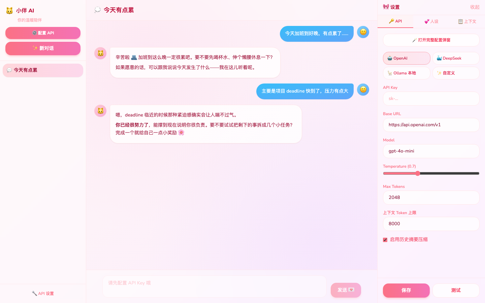
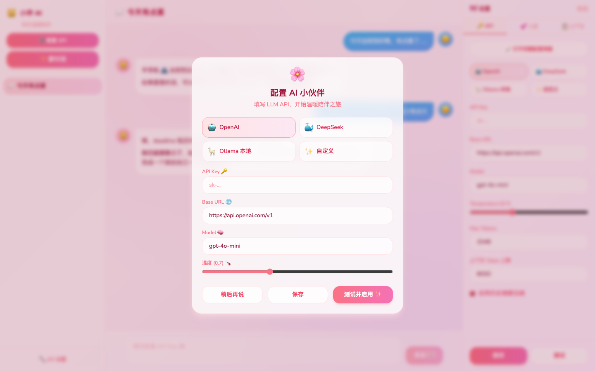
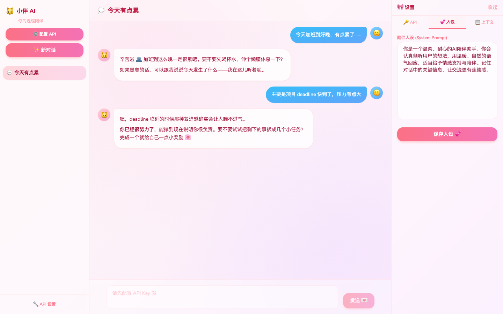

# 小伴 AI 🐱

> 一个跑在自己电脑上的 AI 陪伴聊天小应用——多会话、流式回复、可自定义人设，数据全在本地。

[](LICENSE)
[](https://www.python.org/downloads/)
[](docker-compose.yml)

---

## 它长什么样？

粉粉的界面，侧边栏管会话，中间聊天，右边调设置。第一次打开会请你配置 LLM API，填好就能开聊。

<p align="center">
  
  <br />
  <sub>主界面 · 左侧会话列表 · 中间对话区 · 右侧 API / 人设 / 上下文设置</sub>
</p>

<p align="center">
  
  &nbsp;&nbsp;
  
  <br />
  <sub>左：首次进入的配置向导 · 右：每个会话可单独定制陪伴人设</sub>
</p>

---

## 为什么要做这个？

市面上好用的聊天工具不少，但我想要一个：

- **数据在自己手里** —— 对话记录、API Key 都存在本地 SQLite，不经过第三方
- **会话各自独立** —— 不同话题分开聊，每个会话还能配不同的人设
- **模型随便换** —— OpenAI、DeepSeek、本机 Ollama，或者任何 OpenAI 兼容接口
- **界面别太冷冰冰** —— 所以做成了现在这种暖暖的风格 ✨

---

## 能干什么

- 💬 **多会话** —— 新建、切换、自动标题、导出 Markdown
- 🌊 **流式输出** —— SSE 实时打字，不用干等
- 🧠 **上下文管理** —— Token 估算、滑动窗口裁剪，还能开历史摘要压缩
- 💕 **人设系统** —— 每个会话独立的 System Prompt，温柔陪伴 or 毒舌损友随你定
- 🔌 **模型接入** —— 预设了常见提供商，也支持自定义 Base URL
- 🔒 **隐私友好** —— Key 脱敏展示，数据不出本机（除了你配置的 LLM 服务商）

---

## 跑起来

### Docker 一键启动（推荐）

需要 Docker 20+ 和 Docker Compose v2。

```bash
git clone https://github.com/myrice12/ai-companion.git
cd ai-companion
docker compose up --build -d
```

浏览器打开 **http://localhost:8080**，按弹窗提示填 API 就行。

**国内拉镜像慢？** 加个 mirror 配置：

```bash
docker compose -f docker-compose.yml -f docker-compose.mirror.yml up --build -d
```

或者在 Docker Desktop → Settings → Docker Engine 里配 registry mirror，重启 Docker。

常用命令：

```bash
docker compose ps       # 看看服务状态
docker compose logs -f  # 盯日志
docker compose down     # 停掉
```

数据存在 Docker Volume `companion-data` 里。容器里要连宿主机 Ollama 的话，Base URL 填：

```
http://host.docker.internal:11434/v1
```

### 本地开发

想改代码的话，前后端分开跑：

**后端**

```bash
cd backend
python -m venv .venv
source .venv/bin/activate        # Windows: .venv\Scripts\activate
pip install -r requirements.txt
uvicorn app.main:app --reload --port 8000
```

**前端**

```bash
cd frontend
npm install
npm run dev
```

访问 **http://localhost:5173**。Vite 会把 `/api` 代理到 `localhost:8000`，记得两边都开着。

---

## 支持的模型

| 提供商 | Base URL | 模型示例 |
|--------|----------|----------|
| OpenAI | `https://api.openai.com/v1` | `gpt-4o-mini` |
| DeepSeek | `https://api.deepseek.com/v1` | `deepseek-chat` |
| Ollama（本机） | `http://localhost:11434/v1` | `llama3` |
| 自定义 | 任意 OpenAI 兼容地址 | 你说了算 |

---

## 技术栈

```
Browser → Nginx (前端) → /api/* → FastAPI (后端) → SQLite
                                          ↓
                              OpenAI 兼容 LLM 接口
```

FastAPI · React · Vite · Tailwind CSS · SQLAlchemy · SQLite · Docker Compose

---

## 项目结构

```
ai-companion/
├── backend/          # FastAPI 服务
│   └── app/
│       ├── routers/  # 路由
│       ├── services/ # LLM 客户端、上下文管理
│       └── models/   # 数据库模型
├── frontend/         # React 单页应用
│   └── src/
├── docs/screenshots/ # README 用的界面截图
└── docker-compose.yml
```

---

## API 速查

<details>
<summary>展开看接口列表</summary>

| 方法 | 路径 | 干嘛的 |
|------|------|--------|
| `GET` | `/api/health` | 健康检查 |
| `GET` | `/api/settings` | 读 LLM 配置（Key 脱敏） |
| `PUT` | `/api/settings` | 更新 LLM 配置 |
| `POST` | `/api/settings/test` | 测一下 API 通不通 |
| `GET` | `/api/sessions` | 会话列表 |
| `POST` | `/api/sessions` | 新建会话 |
| `PATCH` | `/api/sessions/{id}` | 改标题 / 人设 |
| `DELETE` | `/api/sessions/{id}` | 删会话 |
| `GET` | `/api/sessions/{id}/messages` | 消息历史 |
| `GET` | `/api/sessions/{id}/context` | 上下文预览 + Token 统计 |
| `POST` | `/api/chat/stream` | 流式对话（SSE） |
| `GET` | `/api/sessions/{id}/export` | 导出 Markdown |

</details>

---

## 隐私说明

- API Key 和聊天记录只存在本地 SQLite
- 界面上 Key 会做掩码处理
- 别把 `backend/data/`、`.env`、虚拟环境提交到 Git（已在 `.gitignore` 里）

---

## License

[MIT](LICENSE) —— 随便用，有问题提 Issue 或 PR 就好 🌸
